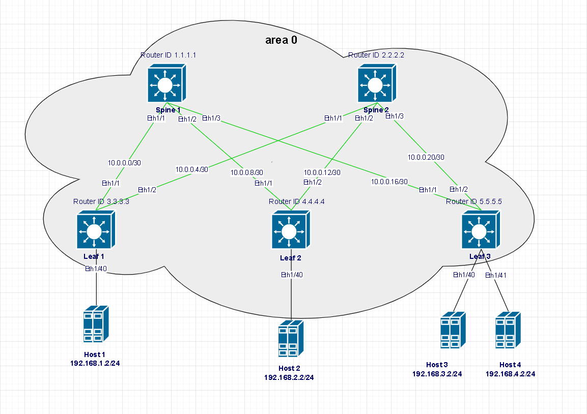
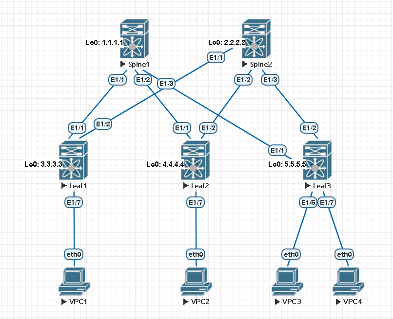
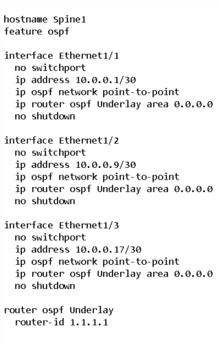
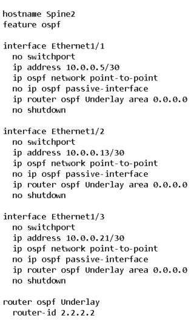
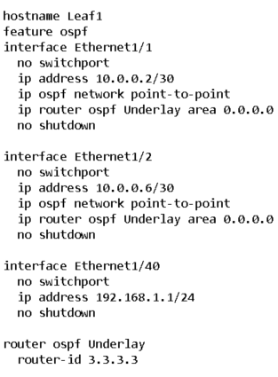
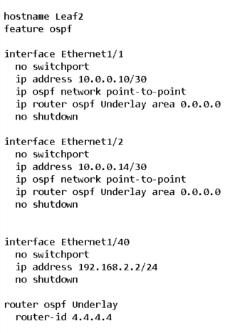
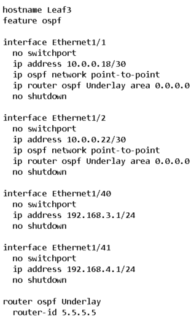

## 1. Цели
* Настроить OSPF в Underlay сети, для IP связанности между всеми устройствами NXOS;

#### Схема сети



<details> 

<summary> Теория </summary>

```

Описание протокола OSPF:
• Link-state
• RFC 2328 (основной), OSPF Version 2 /RFC 5340, OSPF for IPv6
• Protocol 89
• IPv4 224.0.0.5 - all spf routers / 224.0.0.6 – all DR/BDR routers
• IPv6 FF02::5 - neighbor discovery /all spf routers
• Метрика основна на Interface bandwidth
• Использует алгоритм Дейкстры для построения кратчайшего пути

OSPF Adjacency:
• RID должны быть разными у двух устройств
• У соседей должны совпадать сеть и маска сети
• MTU
• Area ID для сегмента
• Hello and Dead timers в сегменте
• Authentication параметры для сегмента
• Stub area flag — должен быть одинаковый

OSPF  в CLOS (задачи в Underlay):
- Доставка маршрутной информации
- Быстрая сходимость (+ BFD)
- Масштабируемость (до 300 роутеров в backbone)
- Поддержка большого количества префиксов
- Мультипротокольное использование (IPv4&IPv6)
- Распределение балансировки (ECMP)
- Удобство автоматизации
добавлять пока не кончатся порты на спайнах. Добавлением спайна можно расширить аплинки лифов.

Рекомендации:
• Использовать point-to-point на интерфейсах
• Указывать RID в явном виде
• Passive-interface default
• Один номер area для каждого pod
• Использовать ip ospf area вместо network (Cisco Nexus specific)
• Использовать BFD
• Избегать использования redistribute
• Применять минимально необходимую конфигурацию OSPF
• Настраивать OSPF adjacency в GRT (не делать underlay внутри vrf)
• Настройка аутентификации

```

</details>

## 2. Адресное пространство для Underlay сети:

#### Адресация интерфейсов на Spine и Leaf:

| Наименование |   Адрес   |      Маска      |    Интерфейс    |
| :----------- |:---------:|  :------------: |  :------------: |
| Spine1       | 10.0.0.1  | 255.255.255.252 |    Ethernet1/1  |
| Spine1       | 10.0.0.9  | 255.255.255.252 |    Ethernet1/2  | 
| Spine1       | 10.0.0.17 | 255.255.255.252 |    Ethernet1/3  | 
| Spine2       | 10.0.0.5  | 255.255.255.252 |    Ethernet1/1  |
| Spine2       | 10.0.0.13 | 255.255.255.252 |    Ethernet1/2  | 
| Spine2       | 10.0.0.21 | 255.255.255.252 |    Ethernet1/3  | 
| Leaf1        | 10.0.0.2  | 255.255.255.252 |    Ethernet1/1  |
| Leaf1        | 10.0.0.6  | 255.255.255.252 |    Ethernet1/2  | 
| Leaf2        | 10.0.0.10 | 255.255.255.252 |    Ethernet1/1  |
| Leaf2        | 10.0.0.14 | 255.255.255.252 |    Ethernet1/2  | 
| Leaf3        | 10.0.0.18 | 255.255.255.252 |    Ethernet1/1  |
| Leaf3        | 10.0.0.22 | 255.255.255.252 |    Ethernet1/2  | 

#### Анонсируемые сети:

| Наименование | Rouer ID |                       Анонсируемые сети                    |
| :----------- |:--------:| :---------------------------------------------------------:|
| Spine1       |  1.1.1.1 | 10.0.0.0/30, 10.0.0.8/30, 10.0.0.16/30                     |
| Spine2       |  2.2.2.2 | 10.0.0.4/30, 10.0.0.12/30, 10.0.0.20/30                    |
| Leaf1        |  3.3.3.3 | 10.0.0.0/30, 10.0.0.4/30, 192.168.1.0/24                   |
| Leaf2        |  4.4.4.4 | 10.0.0.8/30, 10.0.0.12/30, 192.168.2.0/24                  |
| Leaf3        |  5.5.5.5 | 10.0.0.16/30, 10.0.0.20/30, 192.168.3.0/24, 192.168.4.0/24 |

#### Адреса хостов:

|  Хост |     Адрес      |
| :---- |:--------------:|
| Host1 | 192.168.1.2/24 |
| Host2 | 192.168.2.2/24 |
| Host3 | 192.168.3.2/24 |
| Host4 | 192.168.4.2/24 |

## 3. Схема и настройка



#### Настройка Spine1:



<details> 

<summary> Проверка работы Spine1 </summary>

```

Spine1# sh ip ospf neighbors 
 OSPF Process ID Underlay VRF default
 Total number of neighbors: 3
 Neighbor ID     Pri State            Up Time  Address         Interface
 3.3.3.3           1 FULL/ -          01:19:55 10.0.0.2        Eth1/1 
 4.4.4.4           1 FULL/ -          01:21:15 10.0.0.10       Eth1/2 
 5.5.5.5           1 FULL/ -          01:20:15 10.0.0.18       Eth1/3 
Spine1# 
Spine1# sh ip ospf interface br
 OSPF Process ID Underlay VRF default
 Total number of interface: 3
 Interface               ID     Area            Cost   State    Neighbors Status
 Eth1/1                  1      0.0.0.0         40     P2P      1         up  
 Eth1/2                  2      0.0.0.0         40     P2P      1         up  
 Eth1/3                  3      0.0.0.0         40     P2P      1         up  

Spine1#
Spine1# sh ip route 
IP Route Table for VRF "default"
'*' denotes best ucast next-hop
'**' denotes best mcast next-hop
'[x/y]' denotes [preference/metric]
'%<string>' in via output denotes VRF <string>

10.0.0.0/30, ubest/mbest: 1/0, attached
    *via 10.0.0.1, Eth1/1, [0/0], 05:18:50, direct
10.0.0.1/32, ubest/mbest: 1/0, attached
    *via 10.0.0.1, Eth1/1, [0/0], 05:18:50, local
10.0.0.4/30, ubest/mbest: 1/0
    *via 10.0.0.2, Eth1/1, [110/80], 01:20:14, ospf-Underlay, intra
10.0.0.8/30, ubest/mbest: 1/0, attached
    *via 10.0.0.9, Eth1/2, [0/0], 05:17:37, direct
10.0.0.9/32, ubest/mbest: 1/0, attached
    *via 10.0.0.9, Eth1/2, [0/0], 05:17:37, local
10.0.0.12/30, ubest/mbest: 1/0
    *via 10.0.0.10, Eth1/2, [110/80], 01:21:29, ospf-Underlay, intra
10.0.0.16/30, ubest/mbest: 1/0, attached
    *via 10.0.0.17, Eth1/3, [0/0], 05:16:53, direct
10.0.0.17/32, ubest/mbest: 1/0, attached
    *via 10.0.0.17, Eth1/3, [0/0], 05:16:53, local
10.0.0.20/30, ubest/mbest: 1/0
    *via 10.0.0.18, Eth1/3, [110/80], 01:20:30, ospf-Underlay, intra

Spine1# 
Spine1# sh ip ospf database 
        OSPF Router with ID (1.1.1.1) (Process ID Underlay VRF default)

                Router Link States (Area 0.0.0.0)

Link ID         ADV Router      Age        Seq#       Checksum Link Count
1.1.1.1         1.1.1.1         1200       0x80000013 0xd88e   6   
2.2.2.2         2.2.2.2         1211       0x80000018 0xee53   6   
3.3.3.3         3.3.3.3         1196       0x80000010 0xc361   4   
4.4.4.4         4.4.4.4         1274       0x80000010 0x3bc1   4   
5.5.5.5         5.5.5.5         1214       0x8000000e 0xb620   4   

Spine1#

```

</details>

#### Настройка Spine2:



#### Настройка Leaf1:



#### Настройка Leaf2:



#### Настройка Leaf3:




